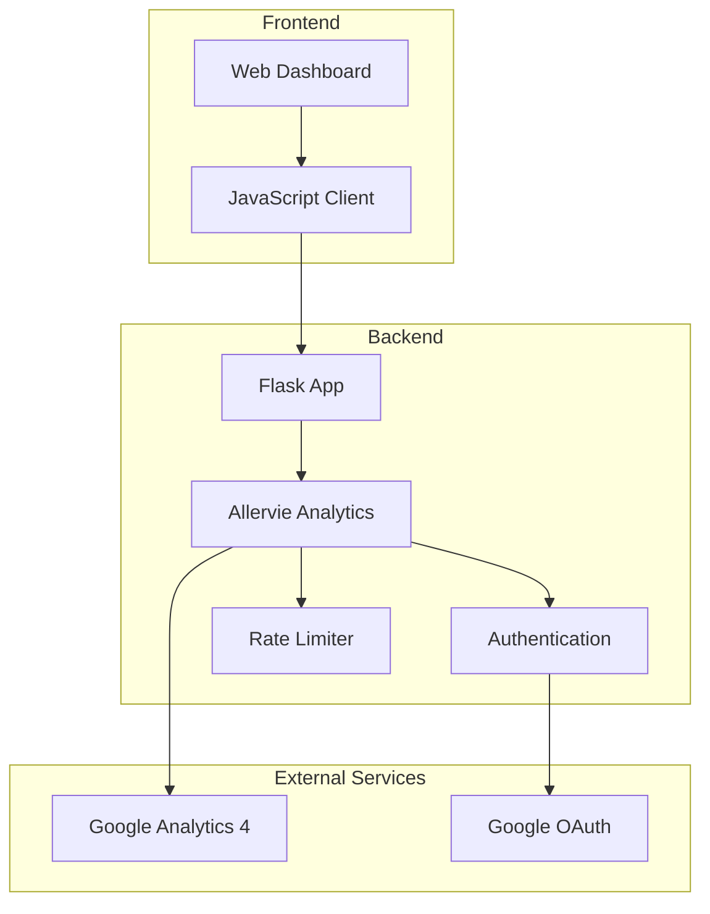
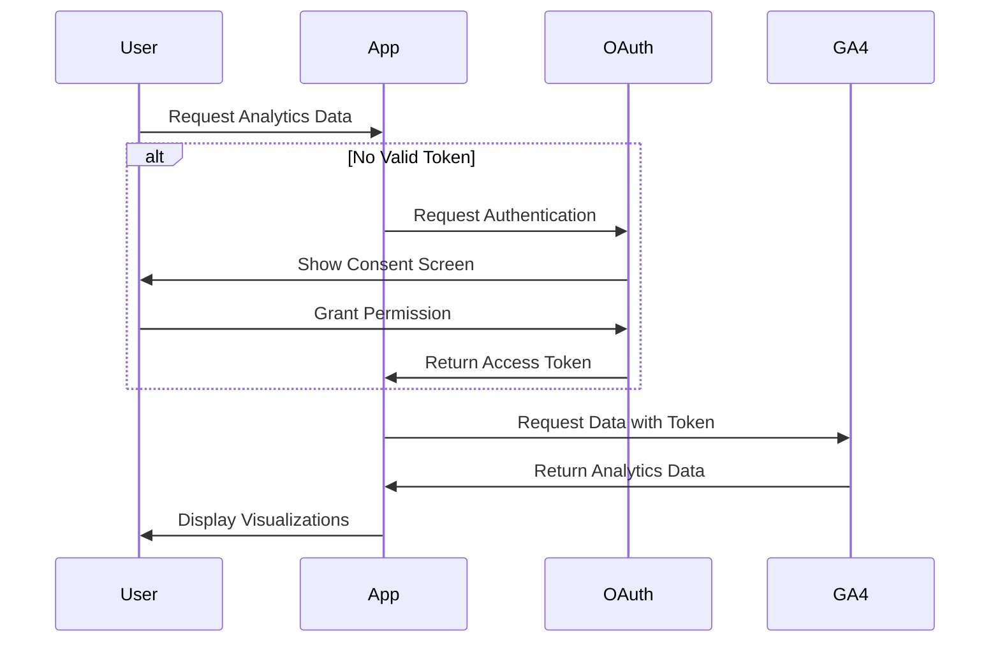
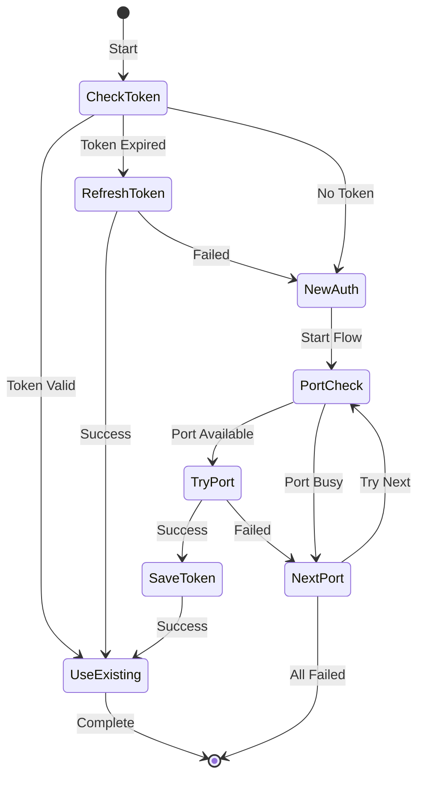

# Allervie Analytics OAuth Flow

A robust Python implementation for authenticating and accessing Google Analytics 4 (GA4) data through OAuth 2.0. This project provides both a programmatic API and a web dashboard for visualizing analytics data.

## Table of Contents
- [Features](#features)
- [Architecture](#architecture)
- [Prerequisites](#prerequisites)
- [Installation](#installation)
- [Configuration](#configuration)
- [Usage](#usage)
- [OAuth Flow](#oauth-flow)
- [API Reference](#api-reference)
- [Web Dashboard](#web-dashboard)
- [Error Handling](#error-handling)
- [Contributing](#contributing)
- [License](#license)

## Features

- **Robust OAuth 2.0 Implementation**
  - Automatic token refresh
  - Multiple port fallback for OAuth redirect
  - Secure credential storage
  - Configurable scopes

- **GA4 Data Access**
  - Active users metrics
  - Traffic source analysis
  - Session data
  - Engagement metrics

- **Web Dashboard**
  - Real-time data visualization
  - Interactive charts
  - Responsive design
  - Cross-browser support

- **Developer Features**
  - Rate limiting
  - Comprehensive error handling
  - Detailed logging
  - Type hints support

## Architecture

### Component Overview



### Data Flow



## Prerequisites

1. Python 3.7 or higher
2. Google Cloud Project with:
   - Analytics API enabled
   - OAuth 2.0 credentials configured
3. Google Analytics 4 Property
4. Node.js 14+ (for development)

## Installation

1. Clone the repository:
```bash
git clone https://github.com/jhillbht/Allervie-Analytics-OAuth-Flow.git
cd Allervie-Analytics-OAuth-Flow
```

2. Create and activate a virtual environment:
```bash
python -m venv venv
source venv/bin/activate  # On Windows: venv\Scripts\activate
```

3. Install dependencies:
```bash
pip install -r requirements.txt
```

4. Set up environment variables:
```bash
cp .env.example .env
```

5. Configure your `.env` file:
```ini
# Flask Configuration
FLASK_APP=run.py
FLASK_ENV=development
FLASK_SECRET_KEY=your-secret-key-here

# Google Analytics Configuration
GA4_PROPERTY_ID=your-property-id
GOOGLE_APPLICATION_CREDENTIALS=client_secret.json
```

## Configuration

### Setting up Google Cloud Project

1. Go to the [Google Cloud Console](https://console.cloud.google.com)
2. Create a new project or select an existing one
3. Enable the Analytics API:
   - Navigate to "APIs & Services" > "Library"
   - Search for "Google Analytics Data API"
   - Click "Enable"

4. Create OAuth 2.0 credentials:
   - Go to "APIs & Services" > "Credentials"
   - Click "Create Credentials" > "OAuth client ID"
   - Choose "Desktop application"
   - Download the credentials file as `client_secret.json`

### OAuth Configuration

The OAuth flow is configured to use high-numbered ports (49152-49155) to avoid conflicts. The authentication module will automatically:

1. Try each port in sequence
2. Fall back to the next port if one is busy
3. Save successful credentials
4. Refresh expired tokens automatically

## Usage

### Programmatic Usage

```python
from allervie_analytics import AllervieAnalytics

# Initialize analytics
analytics = AllervieAnalytics()
analytics.initialize_service()

# Get active users for the last 30 days
active_users = analytics.get_active_users(days=30)
print(active_users)

# Get traffic sources
traffic = analytics.get_traffic_sources(days=7)
print(traffic)
```

### Web Dashboard

1. Start the Flask server:
```bash
python run.py
```

2. Open http://localhost:5000 in your browser
3. Authorize with your Google account when prompted
4. View your analytics data in the dashboard

## OAuth Flow

The OAuth implementation follows these steps:



### Token Storage

Tokens are securely stored in the `token` directory with the following structure:

```
token/
└── allervie_token.json
```

The token file is automatically refreshed when expired.

## API Reference

### AllervieAnalytics Class

Core methods:

#### `initialize_service()`
Initializes the GA4 service with authentication.

#### `get_active_users(days=7, end_date=None)`
Gets active user metrics.

Parameters:
- `days`: Number of days to analyze
- `end_date`: Optional end date (defaults to today)

Returns DataFrame with:
- `date`: Date of metrics
- `active_users`: Total active users
- `new_users`: New users
- `sessions`: Number of sessions
- `returning_users`: Calculated returning users

#### `get_traffic_sources(days=7, end_date=None)`
Gets traffic source metrics.

Parameters:
- `days`: Number of days to analyze
- `end_date`: Optional end date (defaults to today)

Returns DataFrame with:
- `source`: Traffic source
- `medium`: Traffic medium
- `sessions`: Number of sessions
- `users`: Number of users
- `engagement_rate`: User engagement rate

## Web Dashboard

The web interface provides interactive visualizations:

### Active Users Chart
Shows trends for:
- Total active users
- New users
- Returning users

### Traffic Sources Chart
Displays:
- Session distribution by source
- User engagement metrics
- Conversion rates

## Error Handling

The project includes comprehensive error handling:

```python
class AnalyticsError(Exception):
    """Custom exception for analytics errors"""
    pass
```

Common errors:

1. Authentication Failures
   - Invalid credentials
   - Expired tokens
   - Network issues

2. API Errors
   - Rate limiting
   - Invalid requests
   - Permission issues

3. Configuration Errors
   - Missing credentials
   - Invalid property ID
   - Environment issues

## Contributing

1. Fork the repository
2. Create your feature branch:
```bash
git checkout -b feature/amazing-feature
```

3. Commit your changes:
```bash
git commit -m 'Add amazing feature'
```

4. Push to the branch:
```bash
git push origin feature/amazing-feature
```

5. Open a Pull Request

## License

This project is licensed under the MIT License - see the [LICENSE](LICENSE) file for details.

## Acknowledgments

- Google Analytics Data API Team
- Flask Framework
- Chart.js Contributors
- Open Source Community

---

For more information, bug reports, or feature requests, please [open an issue](https://github.com/jhillbht/Allervie-Analytics-OAuth-Flow/issues).